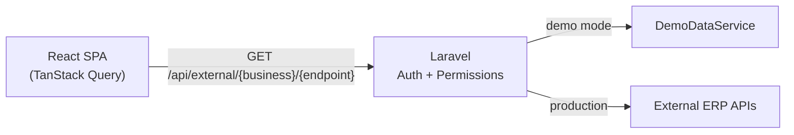

# Multi-Business Analytics Dashboard

A full-stack analytics portal that aggregates operational data from multiple independent ERP systems into one authenticated interface. Built as a Laravel API proxy with a React SPA frontend — designed for role-based access, per-business permissions, and safe credential handling.

<p align="center">
  
  
  
  
  
  
</p>

---

## Overview

This application serves teams that operate several real estate agencies and a property-management business, each running its own ERP. Instead of giving the frontend direct access to multiple APIs, Laravel acts as a **secure proxy**:

- ERP URLs and API keys never reach the browser
- Every data request is authorized on the server (business + view permission)
- The React client only talks to `/api/external/{business}/{endpoint}`

In **demo mode** (`APP_DEMO=true`), the proxy is replaced by a local data service with realistic synthetic data — so the full UI can be explored without any external integrations.



---

## Features

### Dashboards
| Module | Description |
|--------|-------------|
| **Stats** | Revenue targets, achievement charts, and period comparisons (viewings KPIs) |
| **Property Types** | Property-type income breakdowns with collapsible card views |
| **Agents** | Agent performance filtered by agency and property type |
| **Deals** | Closing pipeline with filters by office, agent, and date |
| **Property Services** | PM service fees by location (Zeta Property Management) |
| **Sales Teams** | Per-agency sales team performance tables |

### Platform
| Module | Description |
|--------|-------------|
| **Passcode auth** | Role-based login via Fortify — no usernames, hashed passcodes |
| **Roles & permissions** | Spatie Permission with view, action, and business-level grants |
| **Activity log** | Request auditing (route, IP, browser, device) for non-admin roles |
| **User guide** | Bilingual (EN / AR) in-app documentation for end users |
| **Developer guide** | In-app technical reference for contributors |
| **Dark mode** | System-aware theme toggle |
| **Docker + CI** | Dev/prod Compose stacks and GitHub Actions deploy pipeline |

---

## Tech Stack

| Layer | Tools |
|-------|-------|
| **Backend** | Laravel 13, Fortify, Spatie Permission, Wayfinder |
| **Frontend** | React 19, Inertia v3, TypeScript |
| **Data fetching** | TanStack Query, TanStack Table |
| **UI** | Tailwind CSS v4, shadcn/ui, Radix UI, Recharts, React Select |
| **Tooling** | Vite 8, ESLint, Prettier, Laravel Pint |
| **Infra** | Docker, GitHub Actions, MySQL 8.4 |

---

## Getting Started

### Requirements

- PHP 8.4+
- Composer 2
- Node.js 22+
- SQLite (default) or MySQL

### Quick setup

```bash
git clone <repo-url>
cd dashboards
composer run setup
php artisan migrate:fresh --seed
composer run dev
```

Open [http://localhost:8000](http://localhost:8000) and log in with the seeded passcode:

```
demo-passcode
```

> Override the seed passcode with `SEED_SUPER_USER_PASSCODE` in `.env`.

### Demo mode (recommended for local exploration)

In `.env`:

```env
APP_DEMO=true
```

This routes all external API calls through `DemoDataService` — no ERP credentials required.


### Manual setup

```bash
cp .env.example .env
composer install
php artisan key:generate
touch database/database.sqlite   # if using SQLite
php artisan migrate
php artisan db:seed
npm install
npm run dev        # Vite dev server
php artisan serve  # in a second terminal
```

---

## Docker

**Development** (app + MySQL + hot reload):

```bash
cp .env.example .env   # configure DB_* for MySQL
npm run docker:dev:up
npm run docker:dev:exec
npm run dev
```

App: [http://localhost:8000](http://localhost:8000) · Vite: [http://localhost:5173](http://localhost:5173)

**Production**:

```bash
npm run docker:build
npm run docker:up
```

---

## Project Structure

```
app/
├── Http/Controllers/     # External API proxy, roles, activity log
├── Http/Middleware/      # Activity tracking, Inertia shared data
├── Models/               # User, Role (hashed passcode), Activity
├── Providers/            # Fortify passcode auth, login redirect
└── Services/             # DemoDataService (synthetic ERP data)

config/
├── businesses/           # ERP URLs, keys, endpoints (server-side only)
└── permission.php        # View, action, and business permission catalog

resources/js/
├── pages/                # Inertia page components
├── components/custom/    # Domain tables, filters, charts
├── data/businesses.ts    # Business metadata and feature flags
└── hooks/                # Permissions, appearance, flash toasts
```

---

## Authorization Model

Permissions are grouped into three layers:

1. **Views** — page access (`stats.view`, `agents.view`, …)
2. **Actions** — role management CRUD
3. **Businesses** — per-ERP access (`alpha`, `beta`, …)

Routes are guarded with `permission:*` middleware on both web pages and the API proxy. The sidebar uses the same permission set client-side so navigation stays in sync with server enforcement.

---

## Scripts

| Command | Description |
|---------|-------------|
| `composer run dev` | Laravel server + queue worker + Vite |
| `composer run setup` | Install deps, generate key, migrate, build assets |
| `composer run ci:check` | Lint PHP, ESLint, Prettier, TypeScript |
| `npm run build` | Production frontend build |
| `npm run docker:dev:up` | Start dev Docker stack |

---

## License

MIT
